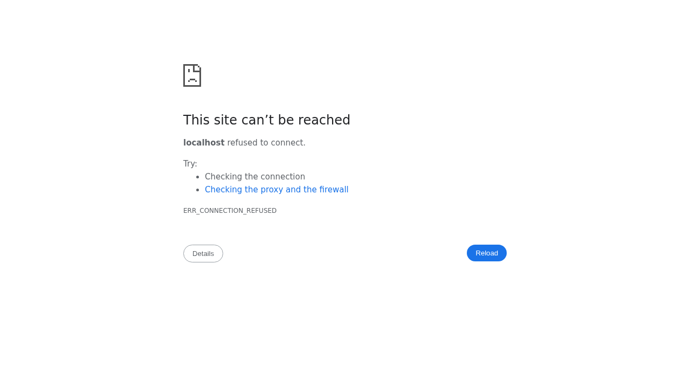

# arahOS Theme — osTicket Theme

A modern navy & gold theme for [osTicket](https://osticket.com) 1.18.x, branded for the **arahOS** organization.

 

## Screenshot



The landing page features a clean navy (#0a1f44) and gold (#f2a900) color scheme with a responsive hero section, search functionality, and ticket management options.

## Features

- 🎨 **Navy `#0a1f44` + Gold `#f2a900`** brand palette driven by a single design-tokens file
- 🖥️ **Full-width backend** — agent & admin panels use the whole screen
- 🔐 **Split-screen agent login** — credentials form + live "Support services" status panel
- 🔁 **Single login** — client `login.php` redirects to the unified agent login
- 📚 **Knowledgebase / FAQ** enabled + seed content (categories, Q&A, Front Page instructions)
- 🌗 **Working light/dark mode** toggle
- 📱 **Fully responsive** — phone, tablet, laptop, desktop (breakpoints 380/480/600/768/900/1100px)
- 📦 **PWA-ready** — install banner, service worker, offline page, manifest + square icons

## Quick install (one command)

```bash
sudo ./install.sh /var/www/osticket/upload
```

## Manual install

1. Copy `plugin/` → `<osticket>/include/plugins/arahOS-theme/`
2. Copy `css/arahOS/arahOS-*.css` → `<osticket>/css/arahOS/`
3. Copy `js/arahOS/arahOS-*.js` → `<osticket>/js/arahOS/`
4. Copy `include/staff/login.tpl.php` and `login.header.php` → `<osticket>/include/staff/`
5. Copy `include/client/header.inc.php`, `footer.inc.php`, `login.inc.php`, `accesslink.inc.php` → `<osticket>/include/client/`
6. Copy `include/staff/header.inc.php`, `footer.inc.php` → `<osticket>/include/staff/`
7. Copy `index.php` → `<osticket>/index.php` (or your landing page)
8. Copy `images/arahOS/`, `manifest.webmanifest`, `sw.js`, `offline.html`, `.htaccess` to web root
9. Set ownership: `chown -R www-data:www-data <osticket>`
10. Enable in **Admin Panel → Manage → Plugins → arahOS Theme**
11. (Optional) Load FAQ content: `mysql -u <user> -p <db> < db/kb-seed.sql`

## Responsive showcase

Browse to `/showcase/responsive.html` after installing — a 3×3 grid (Phone / Tablet / Laptop) × (Landing / Agent login / Staff dashboard) renders the theme at multiple widths. All showcase pages use the generic "arahOS Help Desk" branding so screenshots never expose the live logo.

## Customizing brand colors

Edit **`css/arahOS/arahOS-tokens.css`** — every stylesheet reads from these CSS variables:

```css
--arahOS-navy-900: #0a1f44;   /* header / nav */
--arahOS-gold-500: #f2a900;   /* accent */
```

## Compatibility

- osTicket **1.18.x** (tested on 1.18.4)
- PHP 8.x, MySQL/MariaDB
- HTTPS required for the PWA install prompt + service worker to fully activate

## Credits

♥ Built with passion by Jhonattan L. Jimenez · @OneByJorah

## License

MIT — see [LICENSE](LICENSE).
